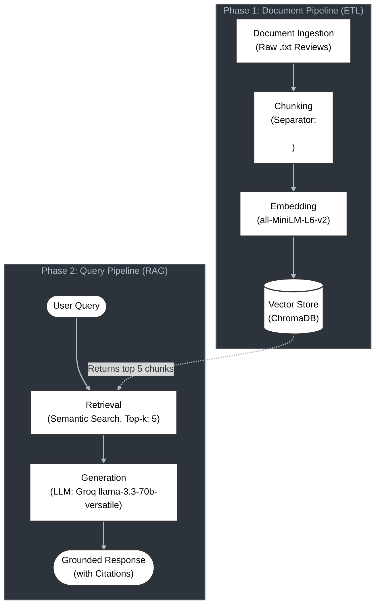

# Project 1 Planning: The Unofficial Guide

## Domain

I found student reviews of CS professors at City Colleges of Chicago - Wright College. The data was collected from Rate My Professors profiles for the various professors. This knowledge is extremely valuable for students picking classes, as it helps them find if a professor would be a good fit for them. Alternatively, it can show problems that other students have had with teaching styles or attitudes for example. There's no official, central collection for this data, and in order to access it you need to search for each professor individually, which can be tedious given there are nearly 20 professors teaching dozens of classes.
---

## Documents

<!-- List your specific sources: URLs, subreddit names, forum threads, or file descriptions.
     Aim for at least 10 sources that together cover different subtopics or perspectives within your domain. -->

| # | Source | Description | URL or location |
|---|--------|-------------|-----------------|
| 1 | RMP | RMP Info for Abdul Khan | documents\Abdul_Khan.txt | 
| 2 | RMP | RMP Info for Dan Grigoletti | documents\Dan_Grigoletti.txt |
| 3 | RMP | RMP Info for Douglas Kaniuk | documents\Douglas_Kaniuk.txt |
| 4 | RMP | RMP Info for Duke Best | documents\Duke_Best.txt |
| 5 | RMP | RMP Info for Erika Nadas | documents\Erika_Nadas.txt |
| 6 | RMP | RMP Info for Gustavo Alatta | documents\Gustavo_Alatta.txt |
| 7 | RMP | RMP Info for Laurie Alfaro | documents\Laurie_Alfaro.txt |
| 8 | RMP | RMP Info for Luke Papademas | documents\Luke_Papademas.txt |
| 9 | RMP | RMP Info for Mohammed Hossain | documents\Mohammed_Hossain.txt |
| 10 | RMP | RMP Info for Ogar Haji | documents\Ogar_Haji.txt |

---

## Chunking Strategy

<!-- How will you split documents into chunks?
     State your chunk size (in tokens or characters), overlap size, and explain why those
     numbers fit the structure of your documents.
     A review-heavy corpus warrants different chunking than a long FAQ. -->

**Chunk size:**
Roughly, all tokens between instances of \n\n (aka by paragraph), which indicates a new review is starting

**Overlap:**
0 token overlap because we are choosing chunk size based on the location of \n\n, this means any overlap introduces errors with conflated reviews

**Reasoning:**
Each review is delineated by a paragraph break, so all relevant information per review is segmented this way naturally. Arbitrarily selecting a specific token size would just create a situation where either multiple reviews were in one chunk, or a single review was spread out over multiple chunks, both are suboptimal.

---

## Retrieval Approach

<!-- Which embedding model are you using (e.g., all-MiniLM-L6-v2 via sentence-transformers)?
     How many chunks will you retrieve per query (top-k)?
     If you were deploying this for real users and cost wasn't a constraint, what tradeoffs
     would you weigh in choosing a different embedding model — context length, multilingual
     support, accuracy on domain-specific text, latency? -->

**Embedding model:**
all-MiniLM-L6-v2 via sentence-transformers using cosine distance

**Top-k:**
5

**Production tradeoff reflection:**
One consideration would be the use of slang in the reviews. The more light weight model all-MiniLM-L6-v2 might miss out on the semantic meaning of some reviews, leading to less accurate embeddings. It's possible a larger, more sophisticaed proprietary model like OpenAI's text-embedding-3-large might be able to compensate for this. Another issue would be API usage. If it was during a time near the registration deadline and the number of users spikes dramatically, the current API setup would likely be insufficient. Paying for a commercial API setup would possibly mitigate this. Another alternative, assuming cost is no issue, would be to build the inference infrastructure locally and run the queries through a locally hosted model.

---

## Evaluation Plan

<!-- List your 5 test questions with their expected correct answers.
     Questions should be specific enough that you can judge whether the system's response
     is right or wrong. "What are good dining halls?" is too vague.
     "What do students say about wait times at [dining hall name] during lunch?" is testable. -->

| # | Question | Expected answer |
|---|----------|-----------------|
| 1 | Which professor or professors have the highest overall ranking? | Dan Grigoletti, Douglas Kaniuk (both have 5/5 overall ranking) |
| 2 | How does Professor Best connect his coursework to the real world and the tech industry? | Professor Best shares valuable insights from his own industry experience. He also brings in industry speakers to provide career path feedback to his students. |
| 3 | What should a student expect regarding the workload, homework, and exams in Professor Khan's classes? | The workload is heavy, with weekly online lab/coding assignments. Grading criteria is clear, and the major grades typically come from these assignments, a midterm, and a final exam. |
| 4 | How does Professor Khan typically deliver his lectures? | Reviews consistently mention that he reads directly from PowerPoints or a notepad. Multiple students noted he makes mistakes during presentations. |
| 5 | What do students say about the textbook used in Professor Haji's class | Students mention that he uses his own self-written textbook. Reviewers note that it is filled with grammar errors, different sized fonts, and excessive clipart, which makes it very difficult to read and causes eye strain. |

---

## Anticipated Challenges

<!-- What could go wrong? Name at least two specific risks with reasoning.
     Consider: noisy or inconsistent documents, missing source attribution, off-topic
     retrieval, chunks that split key information across boundaries. -->

1. If the user asks a question that is worded using formal language, but the reviews include lots of slang, bespoke abbreviations, or misspellings, it may cause errors. The semantic distance between the query and the review text might be too great for the lightweight embedding model to reconcile. This could lead to off topic results or a failure to answer.

2. Reviews might contain information that is conflicting at times which could lead to a confused generation step. A student might talk about the teach being great and the class being fun, but then say the exams were brutal and unfair. Characterizing the sentiments in such a review might be challenging, and the results could be confusing or conflicting.

---

## Architecture

<!-- Draw a diagram of your pipeline showing the five stages:
     Document Ingestion → Chunking → Embedding + Vector Store → Retrieval → Generation
     Label each stage with the tool or library you're using.
     You can use ASCII art, a Mermaid diagram, or embed a sketch as an image.
     You'll use this diagram as context when prompting AI tools to implement each stage. -->

---

## AI Tool Plan

<!-- For each part of the pipeline below, describe:
     - Which AI tool you plan to use (Claude, Copilot, ChatGPT, etc.)
     - What you'll give it as input (which sections of this planning.md, which requirements)
     - What you expect it to produce
     - How you'll verify the output matches your spec

     "I'll use AI to help me code" is not a plan.
     "I'll give Claude my Chunking Strategy section and ask it to implement chunk_text()
     with my specified chunk size and overlap" is a plan. -->

**Milestone 3 — Ingestion and chunking:**

Tool: Claude 4.6 Sonnet
Input: My ## Architecture Mermaid diagram, my \n\n chunking strategy with zero overlap, and the specific requirement to extract the professor's name from the .txt filename and prepend it to every chunk.

Output: A Python script that reads a directory of .txt files, cleans the filenames into professor names, splits the text precisely on \n\n, and outputs a list of dictionaries containing the enriched text and source metadata.

Verification: I will run the script, print(len(chunks)) to ensure it actually split the reviews, and manually inspect print(chunks[0]) to verify that the professor's name was successfully injected into the text string before it gets passed to the embedder.

**Milestone 4 — Embedding and retrieval:**

Tool: Claude 4.6 Sonnet

Input: The output format from Milestone 3, along with the requirement to use sentence-transformers (all-MiniLM-L6-v2), ChromaDB as the vector store, and a Top-k: 5 retrieval parameter.

Output: The Python code to initialize the embedding model, load the chunks and metadata into a ChromaDB collection, and a retrieve_context(query) function.

Verification: I will pass 3 of my semantic evaluation questions (e.g., "What do students say about the textbook used in Professor Haji's class?") into the retrieval function and print the results. I will manually verify that the returned chunks actually contain the relevant keywords and that the ChromaDB cosine distance scores are reasonable (typically under 0.5).

**Milestone 5 — Generation and interface:**

Tool: Claude 4.6 Sonnet

Input: The completed retrieval function, the requirement to use the Groq API (llama-3.3-70b-versatile), the strict instruction for grounded generation with source citations, and the Gradio skeleton code provided in the project hints.

Output: An end-to-end app.py script containing the LLM system prompt, the Groq API call, and the fully wired Gradio web interface.

Verification: I will test the grounding by asking an out-of-scope question (e.g., "What is the capital of France?") to ensure the system refuses to answer. I will then ask a valid question and verify that the LLM explicitly cites the correct source file (e.g., Source: Duke_Best.txt) in its generated response.

**Stretch Goal — Metadata Filtering:**

Tool: Claude 4.6 Sonnet

Input: My existing retrieve_context function and app.py Gradio code, along with the requirement to add a professor dropdown menu to the UI and apply a where={"professor": selected_professor} filter to the ChromaDB collection.query() call.

Output: An updated app.py script containing the new gr.Dropdown widget wired through the generation pipeline, and the modified retrieval function that handles the ChromaDB metadata filter.

Verification: I will test the filter by asking a general question like "Is the homework difficult?" with "All Professors" selected, expecting multiple professors to appear in the results. I will then ask the exact same question with "Ogar Haji" selected and verify that the "Retrieved from" output strictly contains only Ogar_Haji.txt.

**Stretch Goal — Conversational Memory:**

Tool: Claude 4.6 Sonnet

Input: My updated app.py script containing the metadata filter, the requirement to refactor the UI to use gr.ChatInterface, instructions to map the chat history into the Groq API payload ([{"role": "user", ...}, {"role": "assistant", ...}]), and the constraint to preserve the professor dropdown by using the additional_inputs parameter.

Output: A fully refactored app.py script featuring a conversational interface that automatically tracks history, formats it correctly for llama-3.3-70b-versatile, and seamlessly maintains the RAG retrieval loop and source citations across multiple turns.

Verification: I will test the memory by asking an initial question establishing a subject (e.g., "What do students say about Professor Khan's workload?") and then ask a follow-up query using a pronoun (e.g., "Does he accept late work?"). I will verify that the LLM correctly resolves the pronoun to Khan and retrieves the appropriate context to generate an accurate response.